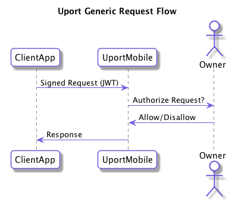
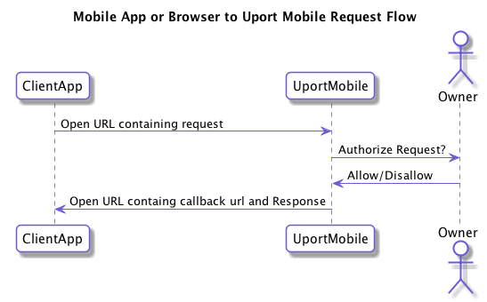

# Uport Request Flows

A request will typically be signed by a client app and sent to mobile app using this generic request flow:

## Specific Application flows

- [Selective Disclosure Flow](selectivedisclosure.md)
- Send Verification Flow
- [Ethereum Transaction Request Flow](tx.md)

## Errors

Wherever possible errors are based on [OAuth 2.0 RFC 6749 Authorization Errors](https://tools.ietf.org/html/rfc6749#section-4.1.2.1)

An `error` parameter is returned as the response to the Client App, containing one of following:

Error         | Description
------------- | -----------
access_denied | User denies the request

## Different Request flows depending on client application type

### Mobile Request Flow

In the case of a mobile app or a web app running in a mobile web browser the request looks like this in more detail:

### Desktop Browser Serverless Flow

For web apps running in a desktop browser with no server backing the flow request flow looks like this:

### Desktop Browser Server Backed Flow

For web apps running in a desktop browser with no server backing the flow request flow looks like this:

