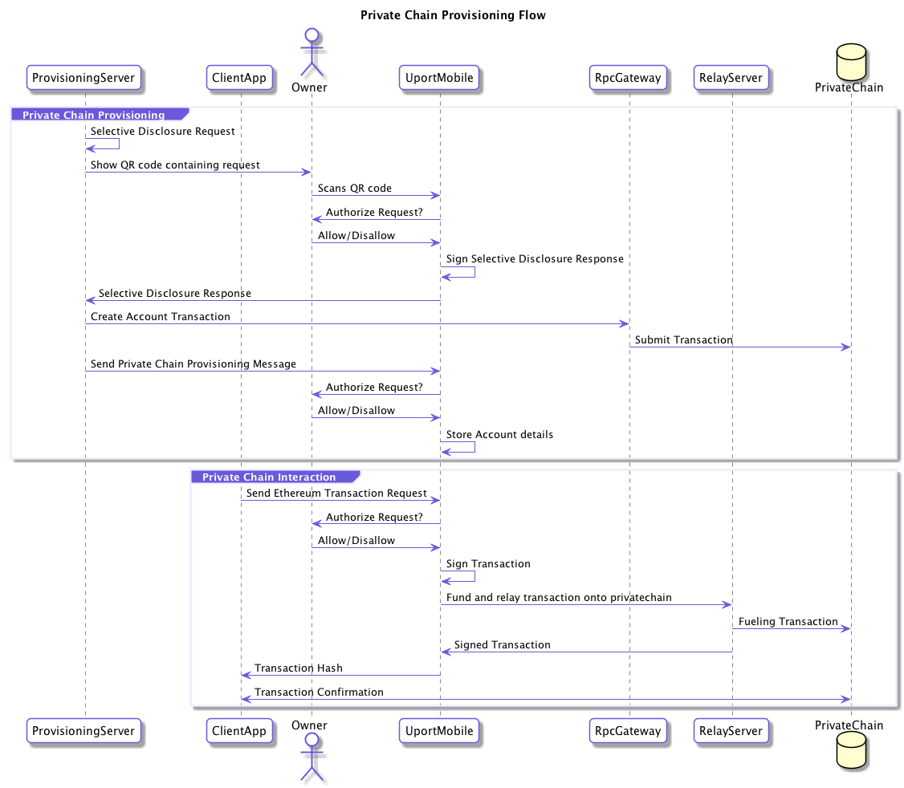

# Private Chain Provisioning Flow

Experimental support for supporting Ethereum Accounts on private chains.

The following shows the basic flow:

## Requirements

- Ethereum compatible blockchain
- Public facing JSON RPC endpoint
- [IdentityManager](https://github.com/uport-project/uport-identity/blob/develop/contracts/IdentityManager.sol) contract deployed on private blockchain
- [Fueling Server](../rest-apis/fuel-server.md) for fueling transactions on private chain

## Provisioning Methodology

1. Use [Selective Disclosure Flow](selectivedisclosure.md) to request primary identity address of user as well as the deviceKey to create a new identity on the private blockchain
2. Create transaction on IdentityManager contract calling `createIdentity` with the devicekey as the `owner`
3. Lookup the `identity` field from the `LogIdentityCreated` event in the receipt from above transaction
4. Create a valid signed [Private Chain Provisioning Message](../messages/privatechain.md) and send it to the uPort mobile app

NOTE: We will provide a better way of provisioning a owner address in future versions of this spec.

## Endpoint

The request should be sent to one of the following URLs:

- `me.uport:net/[JWT]`
- `https://id.uport.me/net/[JWT]`

## Client Callback

The client app SHOULD include a URL where the response is returned from the user. This can be a https url or a custom app url which receives the response.

Responses are param appended to a url fragment. If the callback requires the response as a HTTP POST, it is sent as a JSON POST request to the callback url instead.

### Successful Response

param | Description
----- | -----------
`status`  | `ok`

The client app SHOULD verify that the transaction has been successfully included in a block.

### Errors

An `error` parameter is returned as the response to the Client App, containing one of following:

Error         | Description
------------- | -----------
access_denied | User denies the request
