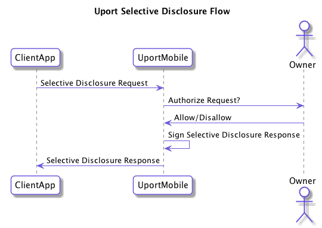

# Selective Disclosure Flow

A client application can request various information from the user.

The following shows the basic flow:

## Endpoint

The request should be sent to one of the following URLs:

- `me.uport:me`
- `https://id.uport.me/me`

## Send Request

Create a valid signed or unsigned [Selective Disclosure Request](../messages/sharereq.md) and send it to the Uport mobile app.

Signed example:

`me.uport:me?requestToken=eyJ0eXAiOiJKV1QiLCJhbGciOiJFUzI1NksifQ.eyJp...`

Unsigned example:

`me.uport:me?callback_url=https://mysite.com/callback&label=My%20Site`

## Client Callback

The client app MUST include a URL where the response is returned from the user. This can be a https url or a custom app url which receives the response.

A sucessfull response is returned as a [Selective Disclosure Response](../messages/shareresp.md) as the `access_token` param appended to a url fragment. If the callback requires the response as a HTTP POST, it is sent as a JSON POST request to the callback url instead.