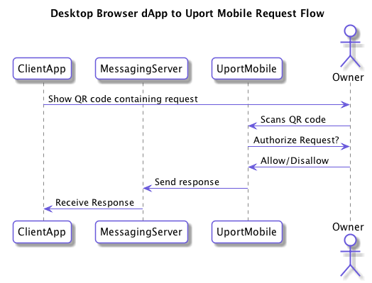

# Request/Response Transports

## Mobile Browser Transport

In the case of a mobile app or a web app running in a mobile web browser the request looks like this in more detail:

- Client App opens the request URL directly and app opens
- Reponse is "redirected" back to client app using the callback url included. Original app opens and handles response.

### Desktop Browser Serverless Transport

For web apps running in a desktop browser with no server backing it the resquest and response transport looks like this:

- The request URL is displayed as a QR code in desktop brower
- User scans QR code using Uport mobile app
- Reponse is sent back to desktop browser using an external messaging server

### Desktop Browser Server Backed Transport

For web apps running in a desktop browser with an application server the resquest and response transport looks like this:

- The request URL is displayed as a QR code in desktop browser
- User scans QR code using Uport mobile app
- Reponse is sent directly to back end server which communicates with App front end in desktop browser

### Push Notification Transport

Any of the above transports can be augmented with our Push Notification Transport mechanism. [We have a detailed article explaining how it works ]:(https://medium.com/uport/adventures-in-decentralized-push-notifications-3c64e700ec18). 

From a protocol point of view it works like this:

- The user performs a regular [Selective Disclosure Flow](selectivedisclosure.md) asking for notification permissions using whichever transport they want
- User authorizes the issuance of a "PushToken" to the client app
- Client App receives response containing PushToken
- All future requests are sent to a Push Server maintained by Uport authenticated using the PushToken as a Bearer token see [RFC 6750](https://tools.ietf.org/html/rfc6750)